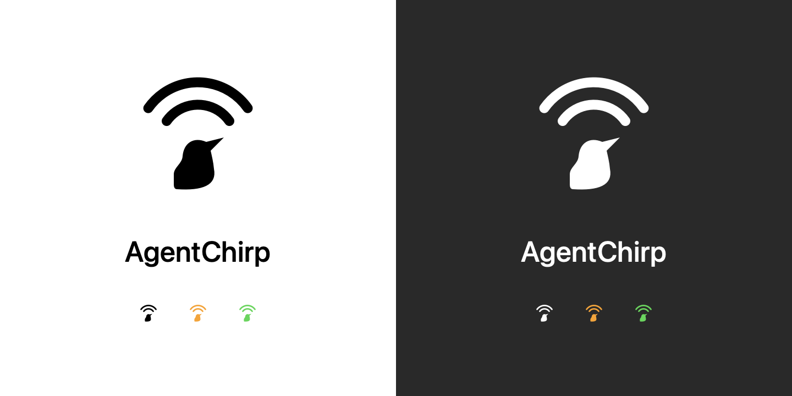

# AgentChirp



A macOS menu bar app that tells you when your Claude Code and Codex agents need attention — without you having to go look.

## The problem

You fire off a Claude Code agent, then switch to another app to keep working. Maybe you open a browser, write docs, review something else. Claude is running in the background.

But you have no idea when it finishes. Or when it hits a decision point and is waiting for your input. You either miss it for too long, or you keep tabbing back to check — which defeats the point of running it in the background.

## What it does

AgentChirp sits in your menu bar and watches your active Claude Code and Codex sessions. You see exactly what's happening across every session, from any app, at a glance.

| State | Menu bar |
|-------|----------|
| No active sessions | Neutral beacon, steady |
| Sessions working | Neutral beacon breathing slowly |
| Needs your input | Three short orange flashes, then steady orange |
| Just finished | Green beacon for 10 seconds |

The icon keeps a fixed width in every state and never animates continuously; hover
for counts. Click it to open the console. The header answers the question in one
line ("2 need input", "3 working", "All quiet") with the beacon lit to match.

Below is one list: sessions that need input first (longest waiting at the top), then
working (longest running first), then idle. Each row shows a state dot, the project,
a clock that says what the time means ("waiting 2m", "working 35m"), and on the second
line the provider and, when the agent is waiting, what it is asking for ("Needs
permission", "Waiting for your answer"). Projects with the same folder name
show their parent folder.

Click anywhere on a row to open its terminal; hover for the full path and token usage.
Terminal jumps support iTerm2 and Terminal.app; rows without a supported terminal
have no action. Arrow keys move between rows, Return opens the selected
session, Escape dismisses the popover. Live updates reorder the list in place without
resizing the open popover.

While any session is working or a Codex session is waiting for input, AgentChirp
keeps your Mac from going to sleep (the display stays on). Three captioned buttons
sit at the top right: Awake turns that off (it then reads May sleep), Sounds toggles
sounds, Quit quits (hover it for
the version).
The console follows your Mac's light or dark appearance and Increase Contrast, and
Reduce Motion removes the flash.

---

## Install

Requires macOS 13 or later. One app runs on Apple Silicon and Intel Macs.

1. Download [AgentChirp.dmg](https://github.com/hosseintoussi/agentchirp/releases/latest/download/AgentChirp.dmg).
2. Drag **AgentChirp** into **Applications** and open it.
3. Review the integration status in the welcome window. Enable **Launch AgentChirp at login** if you want it ready when you sign in.
4. **If you use Codex:** open Codex in your terminal, enter `/hooks`, and review and trust the AgentChirp entries. If they are missing, restart Codex and open `/hooks` again.

The direct download becomes available with the first signed app release. Release
apps are signed with Developer ID, notarized by Apple, and include the native
hook helper. No Homebrew, Python, Xcode, or terminal installation commands are needed.
macOS may show its normal confirmation the first time you open a downloaded app.

**Codex remembers your hook trust—you do not need to repeat this every session.**
New or changed hook definitions require another review; Codex shows a startup
warning when this is needed. Until trusted, those hooks will not run. Installing
AgentChirp does not approve them automatically.

Claude Code hooks are configured automatically when its home directory is present.
AgentChirp never changes Codex hook trust or approval policy. If neither tool is present, AgentChirp
still installs and shows links to get Claude Code or Codex. Either one is enough.
Install and open the tool once; AgentChirp detects its newly created home within
10 seconds and configures the integration. If you add Codex later, complete step 4
after it is detected. **Check again** in AgentChirp Settings retries setup immediately.
It does not install either agent or start a server while waiting for a tool.

### Settings and updates

Click the bird at the left of the console header, press **⌘,** while the console
is open, or open AgentChirp again from Applications to show Settings. There you
can change launch at login, retry integration setup, and check for updates.

AgentChirp checks for updates through Sparkle. Update archives are verified with
both the app's code signature and a dedicated update signing key. Automatic
checks can be turned off in Settings. An update check contacts GitHub; it never
sends your sessions, prompts, paths, or transcripts.

### Build from source

Requires Swift (Xcode or Command Line Tools). Python 3 is used only by the
packaging and test scripts on the developer's machine.

```sh
git clone https://github.com/hosseintoussi/agentchirp.git
cd agentchirp
swift build -c release
.build/release/agentchirp &
```

To build a local app bundle and preview its setup window without changing hooks,
login items, or update preferences:

```sh
python3 scripts/package_app.py --development
dist/AgentChirp.app/Contents/MacOS/agentchirp --installation-check /tmp/agentchirp-setup
```

See [RELEASING.md](RELEASING.md) for signing, notarization, DMG creation, and release credentials.

---

## Hook setup

When Claude Code has been detected, AgentChirp installs (and keeps updated)
`~/.claude/hooks/agentchirp.sh` and its native `agentchirp-hook` helper, and adds missing hook entries to
`~/.claude/settings.json`. Existing entries are never modified — if you've customized
an event's agentchirp hook, your version wins.

---

## Codex support

Codex sessions appear alongside Claude sessions, with a provider label, model, usage,
and the same compact menu bar states. Tested against Codex CLI 0.154.0.

Start Codex normally with `codex` in your terminal. No AgentChirp-specific launcher
is required. AgentChirp detects local terminal clients and reads live status from
Codex’s shared server when available. Older standalone sessions continue using hooks.

AgentChirp also installs the optional `codex-chirp` launcher during setup.
You can run it directly from your terminal:

```sh
"$HOME/Library/Application Support/AgentChirp/bin/codex-chirp"
# Or resume an existing conversation:
"$HOME/Library/Application Support/AgentChirp/bin/codex-chirp" resume --last
```

The launcher starts Codex's local shared
App Server automatically and connects the terminal to it. AgentChirp reads live
thread status about once per second, clears amber when work resumes, and checks
that a request remains unanswered before playing its delayed sound. It never
answers approvals or questions. Plain `codex` sessions that use the local daemon
receive the same monitoring automatically. This integration uses the experimental
App Server interface in Codex CLI 0.154.0.

When a Codex home exists, AgentChirp installs its adapter at
`~/.codex/hooks/agentchirp.sh` and adds missing entries to `~/.codex/hooks.json`.
It preserves existing hooks and does not change `config.toml`, approval policy,
or hook trust. A custom `CODEX_HOME` is supported when AgentChirp is launched with
that environment variable.

**To activate:** restart Codex if needed, open `/hooks`, and review/trust the
agentchirp entries. Then start or resume a session. Codex skips untrusted hooks;
installing AgentChirp alone does not approve them.
Trust is remembered across sessions. You only need to review again if new hook
definitions are added or existing definitions change; Codex warns you at startup.

The adapter observes session start/end, prompts, tool calls, permission requests,
completion, and interruption. Supported input-question tool calls also appear as
waiting. Completion plays the normal cue; interruption does not announce success.
For standalone sessions, approval state clears when the matching tool finishes or the turn stops; permission prompts are visual-only because hooks cannot confirm when approval was granted. Other
parallel tool completions do not clear outstanding approvals.

Terminal jumps use the local Codex client’s iTerm2 or Terminal.app ancestor and TTY.
For shared-server sessions, AgentChirp matches a unique client and thread by project
directory, then tracks that client’s PID and start time. Ambiguous same-project
sessions have no terminal action. Cached idle threads are hidden when their
matched client exits or no client remains in the project; detached work stays visible.
Process-inspection failures preserve rows. This integration does not attach to
remote Codex servers or import historical sessions.

Usage is a best-effort adapter for local Codex JSONL transcripts. It reads only
appended complete records and uses cumulative totals, splitting cached input out
of the IN column so tokens are not counted twice. Missing or changed transcript
formats do not affect hook-based lifecycle tracking.

See [Codex hook documentation](https://learn.chatgpt.com/docs/hooks) for the
supported events and required trust review.

---

## How it works

The shared hook script (`agentchirp.sh`) uses separate Claude and Codex adapters.
Claude Code calls it on these events:

| Hook | Matcher | State written |
|------|---------|--------------|
| `SessionStart` | — | `idle` |
| `UserPromptSubmit` | — | `working` |
| `Notification` | `permission_prompt` | `waiting` |
| `Notification` | `elicitation_dialog` | `waiting` |
| `Stop` | — | `done` |
| `StopFailure` | — | `done` |
| `SessionEnd` | — | session file removed |

Each call atomically writes a small JSON file to `~/.claude/agentchirp/sessions/` including the session's PID, TTY device, and terminal app. AgentChirp watches that directory with `DispatchSource` so state changes appear instantly, plus a 1-second refresh for elapsed times and staleness checks.

Sessions are kept alive as long as their Claude process is running (verified via `kill(pid, 0)` plus a process start-time check that guards against PID reuse). When the session ends — whether from a normal close or the process exiting — it disappears from the menu immediately.

Two `Notification` matchers trigger the amber "needs input" state: `permission_prompt` (tool approval dialogs) and `elicitation_dialog` (option/question UI rendered by Claude). Other notification types are ignored.

A `flock`-based exclusive lock in the hook script prevents a race condition where a `Notification` hook firing mid-run could overwrite a `Stop` hook running at the same moment.

---

## Security

Everything runs locally. The hook script reads session metadata from Claude Code's hook stdin and writes state to `~/.claude/agentchirp/sessions/`. The Codex adapter writes state under `$CODEX_HOME/agentchirp/sessions` (default `~/.codex`).
Both adapters retain session metadata, not prompt or tool content. The app reads
per-session token counts from your local transcript files. Session data stays on your machine. If enabled, update checks contact GitHub to retrieve the release feed and update files; system profiling is disabled.

## License

AgentChirp is available under the [MIT License](LICENSE).
